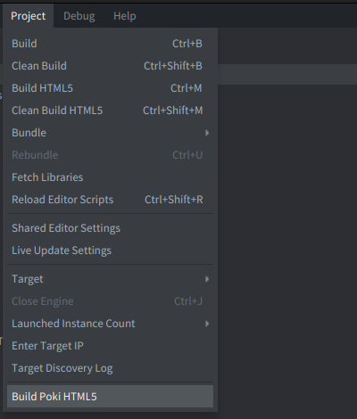
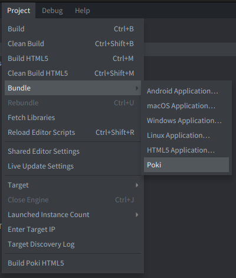

[](https://github.com/defold/extension-poki-sdk/actions/workflows/bob.yml)

# Poki SDK Extension for Defold

This [Defold native extension](https://defold.com/manuals/extensions/) exposes Poki SDK v2 to Lua and supplies Poki-specific HTML5 loading, build, and bundle integration.

## Compatibility

- Defold 1.13.0 or newer
- HTML5 with the `wasm-web` architecture only
- Poki SDK v2

Defold 1.13.0 removed the legacy JavaScript web target. This extension does not support that target or asm.js builds.

## Installation

Add the release ZIP to the `dependencies` field in your `game.project`:

```text
https://github.com/defold/extension-poki-sdk/archive/refs/tags/4.0.1.zip
```

Then select **Project → Fetch Libraries** in the Defold editor.

For other versions, copy the ZIP URL from the [GitHub releases](https://github.com/defold/extension-poki-sdk/releases) page.

## Build and bundle

The extension adds two editor commands:

- **Project → Build Poki HTML5** builds a debug `wasm-web` bundle and opens it in the Poki Inspector.

- **Project → Bundle → Poki** creates a `wasm-web` bundle, packages it as `poki.zip`, and opens the Poki upload flow.


## Example

The example is in [example/poki-sdk.gui_script](example/poki-sdk.gui_script).

## Documentation

Read the [Defold Poki extension manual](https://defold.com/extension-poki-sdk/) and the [Poki developer documentation](https://developers.poki.com/) for the full integration flow and best practices.

## Editor annotations

The extension includes Defold `.script_api` metadata for editor autocomplete and `poki-sdk/api/lls-annotations.lua` for VS Code users running Lua Language Server.
Add the annotation file to your Lua workspace library if your editor does not discover dependency annotations automatically.
