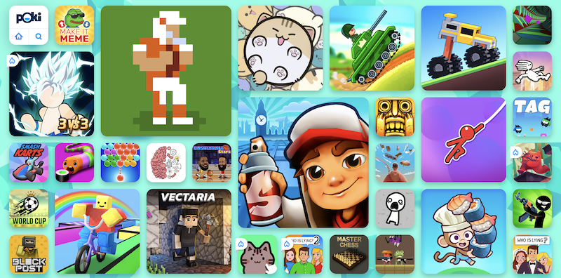
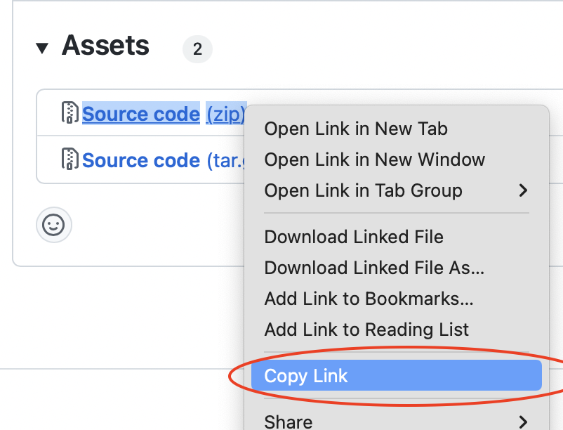

# Defold Poki SDK extension API documentation

This extension provides a Poki SDK integration for Defold. [Poki](https://poki.com) is an online playground where players and game developers come together to play and create. The games on Poki are created by a diverse global game developer community. Got a game? Submit it via [developers.poki.com](https://developers.poki.com).



# Installation
To use Poki SDK in your Defold project, add a version of the Poki SDK extension to your `game.project` dependencies from the list of available [Releases](https://github.com/defold/extension-poki-sdk/releases). Find the version you want, copy the URL to ZIP archive of the release and add it to the project dependencies.



Select `Project->Fetch Libraries` once you have added the version to `game.project` to download the version and make it available in your project.

# Usage


## Implement the gameplay events

Use the `poki_sdk.gameplay_start()` event to describe when users are playing your game (e.g. on first user interaction and unpause).

Use the `poki_sdk.gameplay_stop()` event to describe when users aren’t playing your game (e.g. level finish, game over, pause, quit to menu).

```lua
-- first level loads, player clicks anywhere
poki_sdk.gameplay_start()
-- player is playing
-- player loses round
poki_sdk.gameplay_stop()
-- game over screen pops up
```


## Implement commercial breaks

Commercial breaks are used to display video ads and should be triggered on natural breaks in your game. Throughout the rest of your game, we recommend you implement the `poki_sdk.commercial_break()` before every `poki_sdk.gameplay_start()`, i.e. whenever the user has shown an intent to continue playing.

```lua
-- gameplay stops
poki_sdk.commercial_break(function(self)end)
```

### Important information about commercial breaks

Not every single `poki_sdk.commercial_break()` will trigger an ad. Poki’s system will determine when a user is ready for another ad, so feel free to signal as many commercial break opportunities as possible.


## Implement rewarded breaks
Rewarded breaks allow for a user to choose to watch a rewarded video ad in exchange for a certain benefit in the game (e.g. more coins, etc.). When using `poki_sdk.rewarded_break()`, please make it clear to the player beforehand that they’re about to watch an ad.

```lua
-- gameplay stops
poki_sdk.rewarded_break(function(self, status)
  if status == poki_sdk.REWARDED_BREAK_ERROR then
    print("Rewarded break error!")
  elseif status == poki_sdk.REWARDED_BREAK_START then
    print("Rewarded break start")
  elseif status == poki_sdk.REWARDED_BREAK_SUCCESS then
    print("Rewarded break success")
  end
end)
```

### About the rewarded break timer

Calling `poki_sdk.rewarded_break()` affects the timing of `poki_sdk.commercial_break()` - When a user interacts with a rewarded break, our system’s ad timer is reset to ensure the user does not immediately see another ad.


## Final steps

### Disable sound and input during ads

Make sure that audio and keyboard input are disabled during commercialBreaks, so that the game doesn’t interfere with the ad:

```lua
-- gameplay stops
-- fire your mute audio function, for example:
sound.pause("#music", true)
poki_sdk.commercial_break(function(self)
  -- fire your unmute audio function, for example:
  if status == poki_sdk.REWARDED_BREAK_ERROR or
     status == poki_sdk.REWARDED_BREAK_SUCCESS then
     sound.pause("#music", false)
  end
  -- fire your function to continue to game
end)
```

### Upload and test your game in Poki for Developers

Congrats, you’ve successfully implemented the PokiSDK! Now upload your game to the Poki Inspector and test it there. When you’re happy with the implementation, send Poki a review request and they'll play the game. Feel free to contact Poki via Discord or developersupport@poki.com if you’re stuck.


## Error handling

Do not collect Lua errors manually using `sys.set_error_handler()`. The SDK collects Lua errors and the engine's errors and warnings automatically.

## Shareable URLs & URL manipulation

### Creating shareable urls and changing the Poki.com url

You can create a shareable url with the following function:

```lua
local params = {
  id = "myid",
  type = "mytype",
  score = 28
  -- ... any other param
}
poki_sdk.shareable_url(params, function(self, url)
  print(url)
  -- if run on e.g. https://poki.com/en/g/my-awesome-game it will return:
  -- https://poki.com/en/g/my-awesome-game?gdid=myid&gdtype=mytype&score=28
end)
-- read further to see how to fetch these params easily from within your game
```

### Reading Poki.com url params

As you might have noticed in the previous topic, the `poki_sdk.shareable_url()` creates a url with parameters that are prefixed with gd. We have created a simple helper function that will easily allow you to read the params.

```lua
poki_sdk.get_url_param("<param name>")

-- example
local id = poki_sdk.get_url_param("id")
-- this will return either the gdid param set on poki.com or the id param on the current url
```

## Example

[Refer to the example project](https://github.com/defold/extension-poki-sdk/blob/master/main/poki-sdk.gui_script) to see a complete exameple of how the intergation works.


## Source code

The source code is available on [GitHub](https://github.com/defold/extension-poki-sdk)


## API

The Poki SDK Lua API corresponds to original JS API SDK:

```lua
poki_sdk.gameplay_start() -- in JS it's PokiSDK.gameplayStart()
poki_sdk.gameplay_stop() -- in JS it's PokiSDK.gameplayStop()
poki_sdk.commercial_break(function(self)end) -- in JS it's PokiSDK.commercialBreak()
poki_sdk.rewarded_break(function(self, success)end) -- in JS it's PokiSDK.rewardedBreak()
poki_sdk.set_debug(value) -- in JS it's PokiSDK.setDebug(value)
poki_sdk.capture_error(error_string) -- in JS it's PokiSDK.captureError(error_string)
poki_sdk.shareable_url(params, callback) -- in JS it's PokiSDK.shareableURL({}).then(url => {})
local value = poki_sdk.get_url_param(key) -- in JS it's PokiSDK.getURLParam('id')
poki_sdk.measure(category, what, action) -- in JS it's PokiSDK.measure(category, what, action)
```
